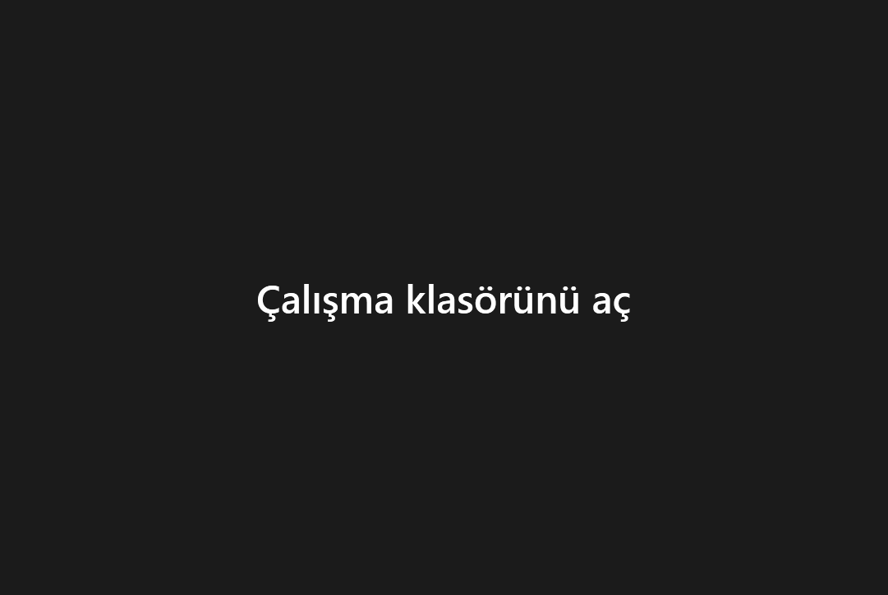
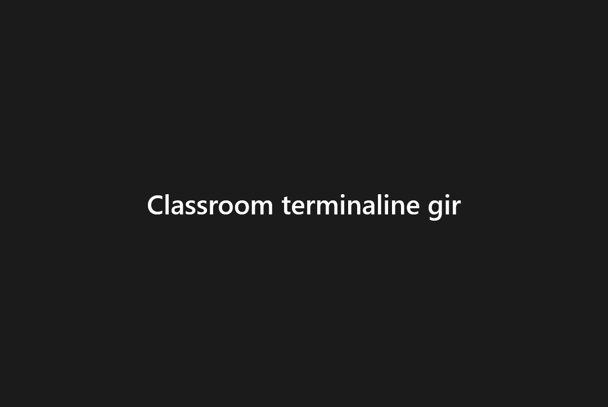

# Çalışma akışı

Classroom ortamında öğrenmede iş akışları.

```txt
The only way to learn a new programming language is by writing programs in it.

        -- Dennis Ritchie
```

Çalışma akışlarında programlama diline özgü farklılıklar olabilir.  Dile özgü açıklamalar için kenar çubuğundaki listeyi
kullanabilirsiniz.

## VS Code ile Classroom içinde geliştirme

Classroom çalışma ortamının en temel özelliği Windows Masaüstü deneyimi ile Linux Geliştirme ortamını bir arada
sunmasıdır.  Bu sayede Windows Masaüstüne alışık olan veya bu deneyimi tercih eden kullanıcılar Windows'u terketmeden
WSL yoluyla kendilerine sunulan bir Linux dağıtımı üzerinde çalışabilirler.  Bu geliştirme etkinliği her biri aşağıdaki
alt bölümlerde özetlenen farklı şekillerde gerçekleşebilir.  Bilinmesi gereken en temel husus tüm bu yöntemlerin VS Code
programlama editöründe kurulması gereken "Remote WSL" eklentisi yoluyla gerçekleştiğidir.  Classroom çalışma ortamı
kurulumunun bir parçası olarak kurulan VS Code editörü "Remote WSL" eklentisi ile hazır geldiğinden başarılı bir
Classroom kurulumunda ilave bir kurulum veya yapılandırma yapmanız gerekmez.  VS Code ve WSL ilişkisi hakkında daha
ayrıntılı bilgi edinmek için otoriter [VS Code dokümanını](https://code.visualstudio.com/docs/remote/wsl) okumanızı
öneririz.

VS Code'un kritik aktör olarak rol aldığı bu yöntemlerde ortak senaryo şu şekilde özetlenebilir:

- Windows tarafında, örneğin Windows ev dizininde, içinde kaynak kodların bulunduğu bir çalışma dizini var.  Bu dizin
  ekran kayıtlarında `C:\Users\vagrant\helloworld-cezmi` olarak örneklenmiştir.  Bu örnekte `vagrant` Windows kullanıcı
  adı, `C:\Users\vagrant` ev dizini, `helloworld-cezmi` ise örnek proje adıdır.  Örneği size ait kullanıcı ve proje
  adlarıyla uyarlayabilirsiniz.

- Tüm düzenlemeler **Windows tarafında** (Scoop paket yöneticiyle) kurulmuş olan VS Code editörüyle yapılacaktır.
  Düzenleme için Linux tarafında herhangi bir editörün kullanılmayacağını lütfen not edin.

- Geliştirme sırasında kullanılacak tüm çalışma zamanı ("runtime") ortamları ve (editör dışındaki) geliştirme araçları
  **Linux tarafında** bulunmaktadır.  Örneğin bir C projesi üzerinde çalışıyorsanız `GCC` vb C derleyicileri Linux
  tarafında kuruludur.  Benzer şekilde bu bir Ruby projesi ise Ruby yorumlayıcısı Linux tarafında hazır kurulu
  durumdadır.

- Windows tarafında bulunan kaynak kodlarla, Linux tarafında bulunan çalışma ve geliştirme zamanı ortamı arasındaki
  ilişki VS Code "Remote WSL" eklentisi üzerinden gerçekleşir.  Bu ilişkinin kurulduğunu VS Code editörünün sol alt
  köşesinde görülen WSL indikatörü ile doğrulayabilirsiniz.

::: danger
Classroom çalışma ortamını başarıyla kurmuşsanız lütfen (özel bir gerekçeniz yoksa) Windows tarafında VS Code editörü de
dahil herhangi bir çalışma veya geliştirme zamanı programı **kurmayın**.  Örneğin Ruby projeleri üzerinde çalışacaksanız
Ruby'nin Windows kurulum paketini kullanmayın, veya C projeleri için Microsoft Visual C++ kurulumu yapmayın.

Ayrıca önerimiz, Classroom çalışma ortamına geçmişseniz, karışıklık çıkarmaması için daha önceden yapmış olduğunuz bu
tür tüm kurulumları kaldırın.  (Tekrar edelim, buna Classrom ortamı haricinde bir yöntemle kurmuş olabileceğiniz VS Code
editörü de dahildir.)
:::

### VS Code içinden WSL'e erişim

Aşağıdaki ekran kaydında ayrıntılı gösterilen yöntemde VS Code editörü içinde kalarak yine Windows tarafında bulunan
çalışma klasörü Classroom Linux ortamında açılmaktadır.  Ekran kaydında görüldüğü gibi çalışma klasörü başlangıçta
"Remote WSL" ile değil normal şekilde açıldığında VS Code ilgili programlama diline ait araçları (örnekte C derleyicisi)
Windows üzerinde aramakta ve hata vermektedir.



### Classroom terminali içinden VS Code'a erişim

Aşağıdaki ekran kaydında gösterilen yöntem ilk yöntemin bir tür dualidir.  İlk yöntemde doğrudan Classroom Linux
ortamına girmeden Windows tarafında VS Code editörü içinde kalırken, bu yöntemde ters yönde giderek önce Classroom Linux
ortamına giriyor ve sonra Windows tarafındaki çalışma klasörüne geçerek VS Code'u çağırıyoruz.  Ekran kaydında çalışma
klasörüne girdikten sonra `code .` komutunu çalıştırdığımızı not edin (sonda "`.`" var).

Bu yöntemde bilinmesi gereken temel bilgi Windows dosyalarının Classroom Linux ortamında `/mnt/<SÜRÜCÜ>` dizin ağacı
altında bulunuyor olmasıdır.  Örneğin Windows tarafında `D:\Yedekler` isimli bir dizini Classroom Linux ortamında
`/mnt/d/Yedekler` dizininde buluyoruz.



::: tip
Bu yöntemi sık kullanacaksınız aşağıdaki düzenlemeleri yapmanızı öneririz:

- Windows tarafındaki çalışma klasörlerinin tümünü tek bir dizin altında toplayın, örneğin
  `C:\Users\vagrant\github-classroom`

- Bu dizine her seferinde `/mnt` üzerindeki dizin adını (`/mnt/c/Users/vagrant/github-classroom`) vererek geçmek yerine
  Linux ev dizininde bir sembolik bağ oluşturun veya daha güzeli [Zoxide](https://github.com/ajeetdsouza/zoxide),
  [Fzf](https://github.com/junegunn/fzf) gibi bir araç kullanın.  Basitliğinden dolayı sembolik dizin oluşturmayı tercih
  edersek aşağıdaki komut kullanabilirsiniz:

  ```sh
  cd ~
  ln -s /mnt/c/Users/vagrant/github-classroom windows
  cd windows
  ```

:::

## Github Classroom ödevleri üzerinde çalışma

::: tip
Ödevler üzerinde çalışırken karşılaşabileceğiniz olası sorunların çözümünü [Sıkça Sorulan Sorular](/help/assignment)
sayfalarında bulabilirsiniz.  **Bu sayfaları mutlaka okuyun.**
:::

Classroom çalışma ortamı Github Classroom üzerinden sunulabilecek programlama ödevleri üzerinde kişisel bilgisayarınızda
çalışmak için uygun araçlar sunar.  Github Classroom üzerinden sunulan bir programlama ödevi üzerinde nasıl
çalışacağınız aşağıdaki kısa videoda örneklenerek anlatılmıştır.  (**Tam ekran izlemenizi öneririz.**)

<iframe width="560" height="315" src="https://www.youtube.com/embed/c9cLaZeF2AY" title="YouTube video player" frameborder="0" allow="accelerometer; autoplay; clipboard-write; encrypted-media; gyroscope; picture-in-picture" allowfullscreen></iframe>
